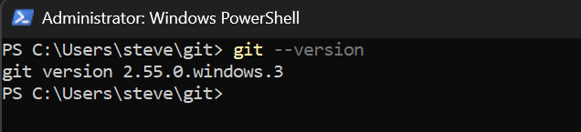

# 1.3 Git, the five commands that matter

Git has a reputation for being hard, earned by people teaching all of it
at once. Daily Git is five commands, and you're going to learn them on
your own vault, where the stakes are your notes instead of somebody's
production code.

First, the mental model, because Git makes no sense without it. Git
doesn't track "versions of a file." It takes snapshots of an entire
folder, whenever you ask, and remembers every snapshot forever. Each
snapshot is called a commit. That's the whole idea. Everything else is
bookkeeping around it.

Why you want this for a journal: fearlessness. Once your vault is under
Git, you can reorganize, rewrite, and delete with total confidence,
because any earlier state is one command away. I've restored
accidentally gutted notes more than once, and the calm that comes from
knowing you can is worth the lesson on its own.

## Install Git

```powershell
# Windows (PowerShell). winget ships with Windows 10/11.
winget install --id Git.Git -e
```

```bash
# Debian/Ubuntu
sudo apt install git

# macOS: running "git" in Terminal offers to install the
# command line tools; accept and you're done.
```

Close and reopen your terminal window afterward. That is not superstition.
The installer puts the `git` program in a new folder, and adds that folder to
your PATH, the list of folders searched whenever you type a command name. PATH
is read once, at the moment a terminal window opens. So a window that was
already open when you installed Git is still working from the older PATH, the
one with no `git` in it, and retyping the command will not change that. A
window you open now reads the updated PATH and finds Git.

**How you know it worked:**

```bash
# Any version number means Git is installed and your shell can find it.
git --version
```

Expect something like `git version 2.43.0`. The number does not matter; this
course uses nothing version-specific.

**What that looks like when it works**, on Windows:



Four things in that picture will differ on your machine and none of them
matter. The version is `2.55.0.windows.3` there and will be something else on
yours. The window says Administrator because that one happened to be elevated,
and this command does not need it. The prompt shows `C:\Users\steve\git`
because that is where the window happened to be sitting, and `git --version`
works from any folder, so you do not need to go anywhere first. And it is
PowerShell rather than Git Bash, because this is one of the commands that
behaves the same in both, and the next section is where the course picks a
shell and explains why.

What should match is the shape: you type the command, one line comes back
starting with `git version`, and you get a fresh prompt. If you have never
worked in a terminal before, that loop is the entire interface, and you are
about to spend the rest of this course in it.

**If you get "command not found" or "not recognized"**, the window you are
typing in is still running with the old PATH. Close every terminal window and
open a fresh one.
If it still fails after that, the install did not finish, and running it again
is safe.

## The shell this course uses

Two words have been doing similar work above, so here is the difference once,
because from now on they mean different things. The **terminal** is the
window. The **shell** is the program running inside that window: it reads what
you type, works out what you meant, and runs it. Windows machines come with
PowerShell, Linux with bash, macOS with zsh, which is bash's close relative.
Change the shell and the window looks identical while the commands it accepts
change underneath you. That is exactly the trap this section is about to spare
you.

Windows users just got something extra without being told: the Git
installer ships **Git Bash**, a real bash shell running on Windows. Find
it in the Start menu, or right-click a folder and choose "Open Git Bash
here".

That matters because it means every student on this course, whatever
machine they're on, now has the same shell available. So the course
picks one:

:::tip[When a block says `bash`, use bash]
On Linux and macOS that's your normal terminal. On Windows it's **Git
Bash**, not PowerShell.

Most of those commands would work in PowerShell too, and you're welcome
to try. The reason the course names one shell rather than saying "either
is fine" is that "either is fine" quietly makes *you* responsible for
knowing which commands are the exceptions. You shouldn't have to think
about it. Open Git Bash and paste.
:::

**PowerShell is not being taken away from you.** It shows up over ninety
times in this course, and almost all of it is in Modules 5, 7 and 8,
where you administer Windows Server: creating users in Active Directory,
installing roles, issuing certificates. Module 2 teaches you to write
PowerShell scripts properly. That's the PowerShell worth having, and
none of it is affected by this.

What you're being spared is the version that isn't really PowerShell.
Typing `cd` to change folder teaches nobody anything, and it's exactly
the kind of command where the small differences between shells cost you
ten minutes for no benefit.

**So from here on, the block tells you where you are.** A `bash` block
means your own machine (or, from Module 6, a Linux server you've
connected to). A `powershell` block means you're administering a Windows
machine. That's a useful signal, and it only works if it's consistent.

:::note[One Git Bash quirk, met once]
Git Bash writes Windows paths the Unix way: `C:\Users\you` appears as
`/c/Users/you`. Nothing is wrong when you see that. It's the same folder,
described in the shell's own dialect, and `~` still means your home
folder in both.
:::

Now introduce yourself to Git. It stamps this onto every commit:

```bash
git config --global user.name "Your Name"
git config --global user.email "you@example.com"
```

One more setting, and this one saves you a confusing failure in Module 6.

When Git creates a repository it has to name the first branch. **A branch is
just a name for a line of history**; you will only have one for a long while.
Git's own default is still `master`, but the industry moved to `main` years
ago, and every hosting service, every example in this course, and Modules 10
and 12 all assume `main`. Mixing the two produces an error message
(`src refspec main does not match any`) that tells you nothing about the
actual cause.

```bash
# Name the first branch "main" in every repository you create from now on.
git config --global init.defaultBranch main
```

**How you know all three took:**

```bash
# Prints back what Git now believes about you.
git config --global --list
```

You should see your name, your email, and `init.defaultBranch=main`. If a
line is missing, run that one command again and watch for a typo in
`--global`.

## Put the vault under Git

```bash
# Move into the vault folder you made in lesson 1.2.
cd ~/git/lab-journal

# Turn this folder into a Git repository. This creates a hidden
# .git directory where every snapshot will live. Your files are
# not touched. -b main names the first branch explicitly; the
# setting above would do it anyway, and saying it out loud here
# means this command is correct on any machine you paste it into.
git init -b main

# What does Git see? Everything, currently "untracked."
git status
```

## The ignore rules

Before the first commit, a problem worth meeting on purpose. Obsidian
keeps a file called `.obsidian/workspace.json` that remembers which tabs
you had open, and it changes every time you breathe. Snapshot it and
every future commit fills up with noise about nothing.

Git's answer is a file named `.gitignore`: a plain-text list of paths
Git pretends not to see. There's nothing to activate or turn on. If the
file exists in the repository, Git reads it, every time, automatically.
The starter vault shipped one; confirm it survived the unzip, since
files starting with a dot like to play hidden:

```bash
# Say where you are out loud before looking for a file. This should
# print the path to your vault, ending in lab-journal. If it ends in
# just "git", you are one folder too high up.
pwd
cd ~/git/lab-journal

# -a lists dotfiles too, and .gitignore is one. This is a bash flag:
# in PowerShell the equivalent is "Get-ChildItem -Force", which is
# the sort of difference the shell rule above exists to spare you.
ls -a

# Print it. Every line is a path Git will skip, and the comments
# explain why each one deserves to be skipped.
cat .gitignore
```

You should be looking at this:

```text
# Per-machine Obsidian state: window layout, open tabs, cache. Syncing
# these between machines causes pointless conflicts, so Git ignores them.
.obsidian/workspace.json
.obsidian/workspace-mobile.json
.obsidian/cache
.trash/
```

**If `cat` said `No such file or directory`, check where you are before you
believe it.** Nine times out of ten the file is fine and the shell is in the
wrong folder, because the `cd` above happened a few minutes and one section
ago, and a terminal you closed and reopened comes back in your home folder.
`~/git` is a particularly easy place to be standing, since that is the folder
you made in lesson 1.2 and it is one level above the vault. Run `pwd` again
and read the answer properly: it has to end in `lab-journal`.

Only if `pwd` is right is the file genuinely missing, and then the cause is
almost never the `.gitignore` on its own. Dot-files travel badly when a folder
is copied by hand, because Finder and File Explorer hide them by default and a
select-all misses what it cannot see. So check whether the others made it:

```bash
# Both of these should exist. .obsidian holds your Obsidian settings.
ls -a
ls .obsidian
```

If `.obsidian` is missing too, do not patch the `.gitignore` by hand. You are
looking at a half-copied vault, and hand-fixing one file leaves you with the
other losses still in place, discovered one at a time over the next week.
Unzip `starter-vault-main.zip` again, and this time move the folder itself
rather than selecting its contents, which is what drops the hidden files.

Note what's *not* ignored: the rest of `.obsidian/`, including the
daily-notes and template settings. Those you want travelling with the
vault to any future machine. The line between the two is the principle:
share configuration, ignore per-machine state. You'll redraw that line
in every tool you ever put under version control.

Now watch the rules work:

```bash
# -uall makes status name every untracked file individually instead
# of collapsing folders. The .obsidian settings files appear;
# workspace.json does not, because the rules are already active.
git status -uall

# And the direct question: "would Git ignore this path?" If it
# prints the path back, the answer is yes. Silence means no.
git check-ignore .obsidian/workspace.json
```

Knowing *why* a file is ignored is the difference between using a
config and cargo-culting one, which is why the checkpoint at the end of
this module asks Git this exact question again.

## The daily rhythm

```bash
# Stage everything that changed. "Staging" is choosing what goes
# in the next snapshot; -A means "all of it."
git add -A

# Take the snapshot, with a message future-you will read.
git commit -m "journal: first day under version control"

# Look at your history. One line per commit, newest first.
git log --oneline
```

Make a change to any note, save it, and run the three again. Then once
more. The rhythm you're building (`status`, `add`, `commit`) is the
same one you'll use on Ansible playbooks in Module 10 and detection
rules in Module 12. There's a cheatsheet already in your vault at
`Resources/cheatsheets/git-basics.md`, which also covers `git diff` and
`git restore`, the two commands for when something went sideways.

Commit at the end of every lab session from now on. It takes ten
seconds, and it's the habit the rest of the course quietly depends on.
